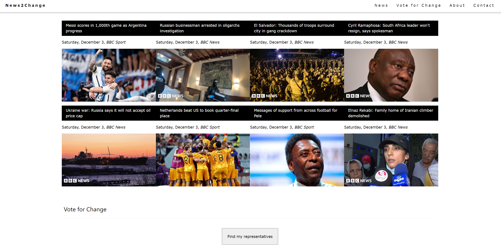
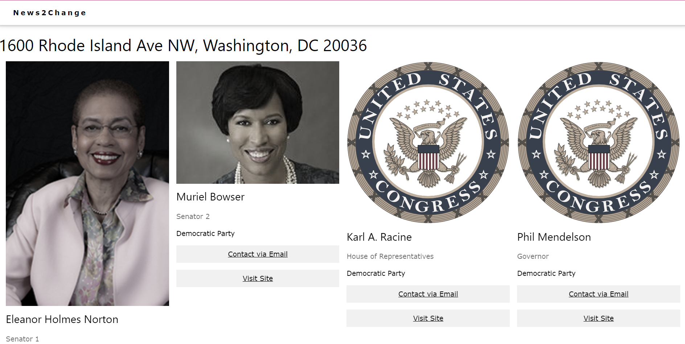

# News2Change
News2Change identifies news trends happening near you and across the country in a few clicks. Local representatives are also shown to make advocacy more accessible. 

Fetching from News API, the top 8 international stories from the BBC,  with their links, sources, and images are displayed.

I used the Civic Information API to display the user's representatives by their address from Geocodio. Each representative's party affiliation, a picture (if available), and contact information are displayed.

